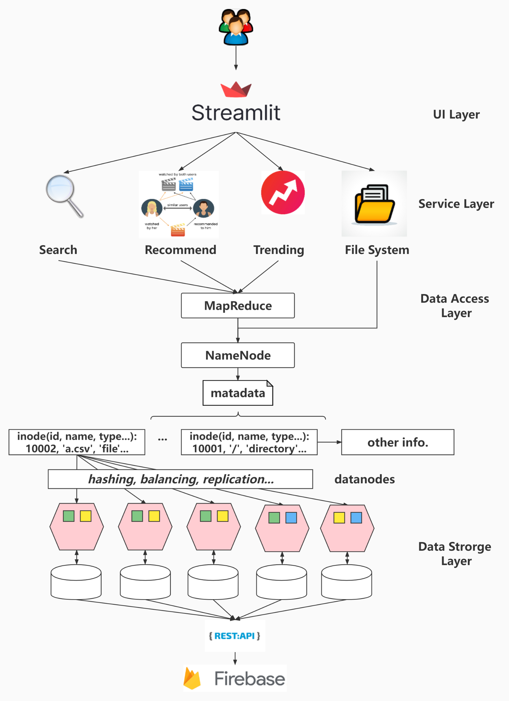
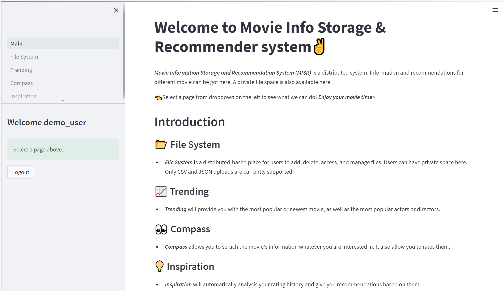
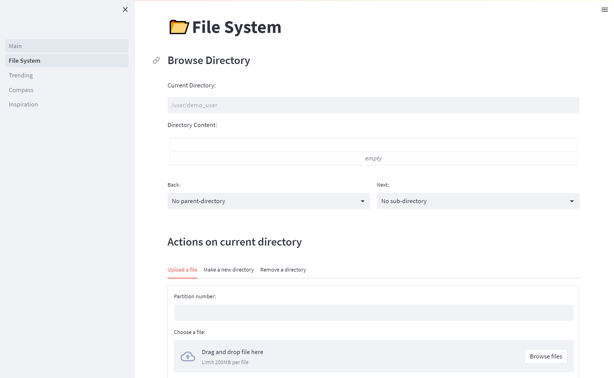
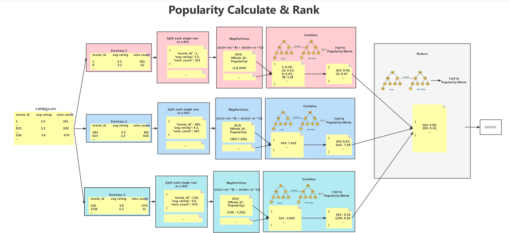
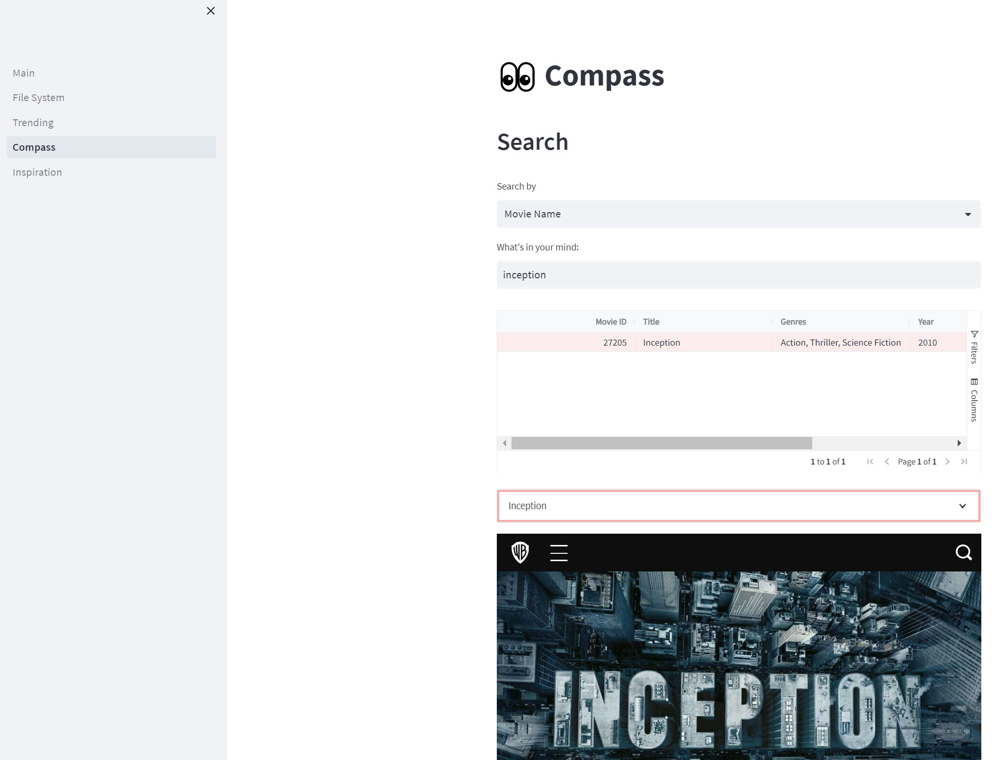
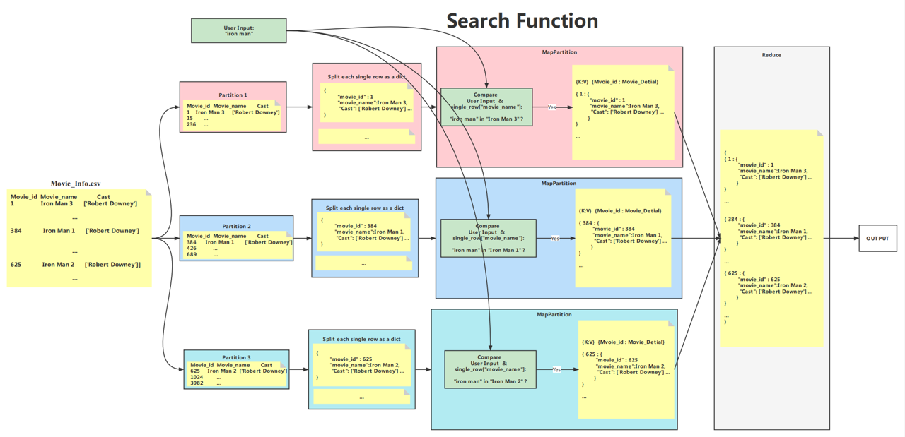
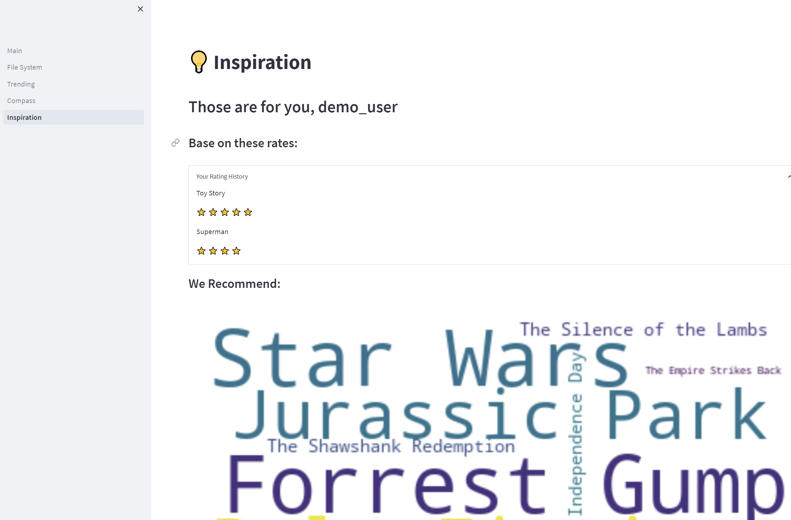
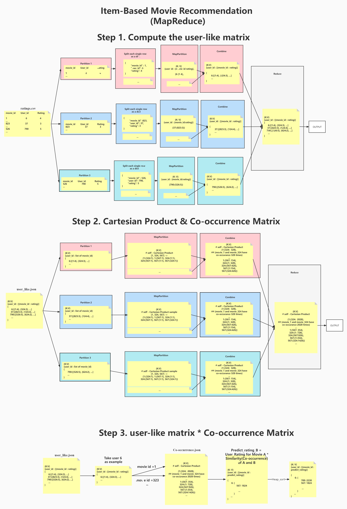

# Emulation-based System for Distributed File storage and Parallel Computation

### Architecture:


### Home page:



### Distributed file system dashboard



### Trending Movie Computation using MapReduce




### Data Retrieval using MapReduce




### Item-based collaborative filtering recommendation using MapReduce




**# Prerequisite:**

```bash
pip install streamlit-aggrid

pip install wordcloud

pip install streamlit

pip install pandas
```

**# How to start in command line:**

```python
streamlit run Main.py 
```

**# Username & Password for demo:**


```markdown
username: admin 

password: abc123

username: demo_user

password: 123123
```

**# File description:**

```markdown
  pages: Front-end directory
  kaggle_data_sources: Original data source
  command: Back-end implementation code
  pre_stored_matrix: Item_CF training result
  firebase.py: Initialization of firebase
```
