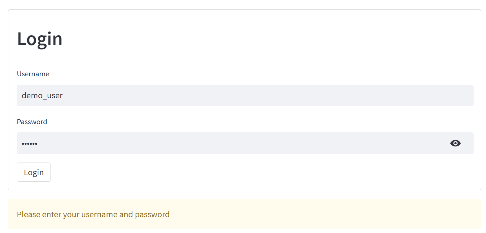

# Emulation-based System for Distributed File storage and Parallel Computation

#### Architecture:
<div align=center>

</div>

#### Home page:
<div align=center>

</div>

#### Distributed file system dashboard
<div align=center>

</div>

#### Trending Movie Computation using MapReduce
<div align=center>


</div>

#### Data Retrieval using MapReduce
<div align=center>


</div>

#### Item-based collaborative filtering recommendation using MapReduce
<div align=center>


</div>

#### Prerequisite:

```bash
pip install streamlit-aggrid

pip install wordcloud

pip install streamlit

pip install pandas
```

#### How to start in command line:

```python
streamlit run Main.py 
```

#### Username & Password for demo:
<div align=center>

</div>

```markdown
username: admin 

password: abc123

username: demo_user

password: 123123
```

#### File description:

```markdown
  pages: Front-end directory
  kaggle_data_sources: Original data source
  command: Back-end implementation code
  pre_stored_matrix: Item_CF training result
  firebase.py: Initialization of firebase
```
